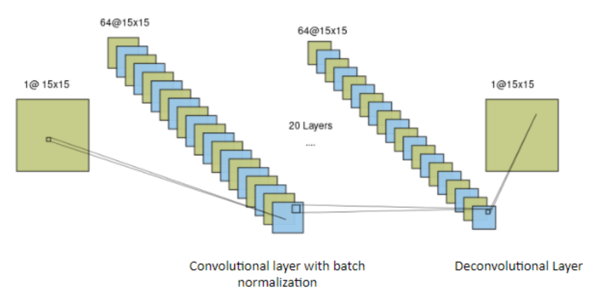
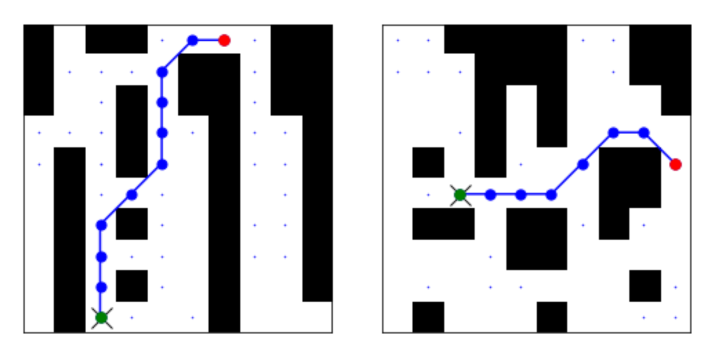
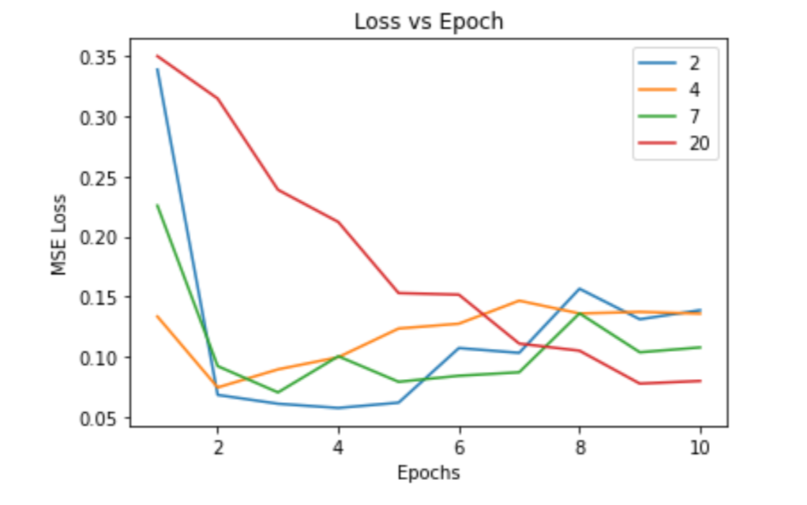

# Path Planning

This project is our implementatin of the paper [One-Shot Multi-Path Planning for Robotic Applications Using Fully Convolutional Networks](https://ieeexplore.ieee.org/document/9196719)

## Problem Statement
In this project we aim to improve on the computation time of the traditional A* search algorithm with Neural Networks. We demonstrate that our method is able to successfully generate optimal or close to optimal paths.

## Architecture

## Training Dataset path

## Results

## Contributors
1. [Prathamesh Ringe](https://github.com/PSR794)
2. [Rishabh Verma](https://github.com/RiVer2000)
3. [Sania Subhedar](https://github.com/Sania08)
4. [Yagnesh Devada](https://github.com/yagdev99)
